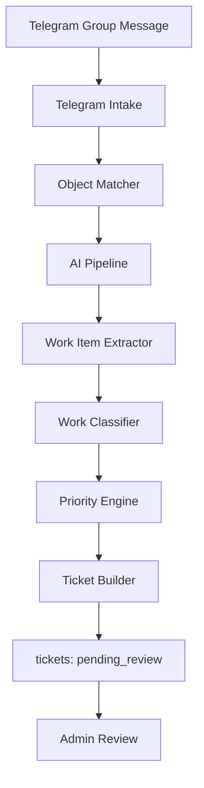

# AI v2 Architecture: Polissya Service Desk

## Мета

AI v2 для Polissya Service Desk працює не просто із "заявками", а з **Work Items**.

**Work Item** - це окрема незалежна робота або доручення, яке AI витягує з одного повідомлення Telegram-групи. Одне повідомлення може створити 0, 1 або багато Work Items. Після перевірки кожен Work Item перетворюється на окремий ticket зі статусом `pending_review`.

Таблицю `tickets` поки не перейменовуємо. У коді можна використовувати модель `WorkItem` як AI-рівень, але в базі залишаються `tickets`.

## Загальний Потік



## 1. Telegram Intake

Telegram Intake відповідає за прийом повідомлень з Telegram-групи.

Основні правила:

- читає текстові повідомлення з групи;
- ігнорує приватні повідомлення;
- ігнорує команди, наприклад `/start`;
- ігнорує повідомлення від ботів;
- ігнорує пусті повідомлення;
- передає текст у AI pipeline;
- не створює заявки самостійно без результату AI-аналізу.

Вхід:

```json
{
  "chatId": "-1001234567890",
  "messageId": "384",
  "userId": "123456",
  "userName": "Олена (@olena_store)",
  "text": "Хлібна 22 протікає унітаз"
}
```

## 2. Object Matcher

Object Matcher шукає об'єкт компанії за текстом повідомлення.

Пошук має використовувати:

- назву об'єкта;
- адресу;
- місто;
- район;
- aliases;
- варіанти без ком і пробілів;
- українські та російські варіанти, якщо вони є в aliases.

Результат:

```json
{
  "status": "exact",
  "bestMatch": {
    "id": "store_hlibna_022",
    "name": "Магазин Хлібна 22",
    "address": "м. Житомир, вул. Хлібна, 22"
  },
  "candidates": [],
  "confidence": 0.99,
  "reason": "Локально знайдено точний збіг об'єкта."
}
```

Можливі статуси:

- `exact` - точний збіг;
- `high_confidence` - високий рівень впевненості;
- `ambiguous` - є кілька схожих кандидатів;
- `not_found` - об'єкт не знайдено.

Якщо локальний пошук не впевнений, top candidates передаються в AI. AI може вибрати лише один об'єкт із кандидатів. Якщо AI також не впевнений, заявка не створюється.

## 3. Work Item Extractor

Work Item Extractor виділяє незалежні роботи з повідомлення.

Він має підтримувати:

- нумеровані списки: `1.`, `1)`, `1-`;
- маркери: `-`, `•`;
- текст без списків;
- перенос рядків;
- одне довге речення з кількома роботами;
- текст у дужках як уточнення до description.

Ключове правило:

> Якщо роботи можуть виконувати різні працівники або вони не залежать одна від одної, це окремі Work Items.

Не треба дробити одну проблему на кілька заявок:

```text
Унітаз дуже гуде та постійно набирається вода.
```

Це один Work Item, бо проблема стосується одного вузла.

Адреса не потрапляє в description Work Item. Адреса використовується тільки для Object Matcher.

## 4. Work Classifier

Work Classifier визначає зміст кожного Work Item.

Для кожного Work Item він повертає:

- коротку назву;
- повний опис;
- категорію;
- тип роботи;
- рекомендований підрозділ;
- confidence.

Типи роботи:

- `repair`;
- `install`;
- `replace`;
- `inspect`;
- `administrative`;
- `cleaning`;
- `safety`;
- `other`.

Приклад:

```json
{
  "title": "Повісити вогнегасник",
  "description": "Потрібно повісити вогнегасник на об'єкті.",
  "category": "Будівельні роботи",
  "workType": "safety",
  "recommendedDepartment": "Будівельні роботи",
  "confidence": 0.91
}
```

## 5. Priority Engine

Priority Engine визначає пріоритет:

- `low`;
- `medium`;
- `high`;
- `critical`.

Фактори для пріоритету:

- вода і протікання;
- електрика;
- безпека;
- холодильне обладнання;
- санітарія;
- миші або ризик шкідників;
- аварійність;
- вплив на роботу магазину.

Орієнтири:

```json
[
  { "case": "не працює лампа", "priority": "low" },
  { "case": "протікає унітаз", "priority": "high" },
  { "case": "вибиває світло", "priority": "high" },
  { "case": "немає електрики в магазині", "priority": "critical" },
  { "case": "не працює холодильне обладнання", "priority": "high" },
  { "case": "можуть залазити миші", "priority": "high" }
]
```

## 6. Ticket Builder

Ticket Builder перетворює кожен Work Item у ticket.

Для кожного ticket зберігається:

- `object_id`;
- `title`;
- `description`;
- `category_id`;
- `priority`;
- `status = pending_review`;
- `source = telegram_group`;
- `telegram_chat_id`;
- `telegram_message_id`;
- `telegram_source_group_id`;
- `telegram_user_id`;
- `telegram_user_name`;
- `original_message_text`;
- `ai_confidence`;
- `ai_raw_result`;
- `recommended_department`.

`telegram_source_group_id` має формат:

```text
${telegram_chat_id}_${telegram_message_id}
```

Усі заявки, створені з одного повідомлення, мають однаковий `telegram_source_group_id`.

## 7. Admin Review

AI не запускає роботи автоматично.

Адмін або відповідальний користувач переглядає кожну заявку окремо:

- підтвердити заявку: `pending_review -> new`;
- відхилити заявку: `pending_review -> rejected`.

У картці заявки показуються пов'язані заявки з того самого Telegram-повідомлення.

## 8. Future Modules

Майбутні модулі AI v2:

- **Material Estimator** - оцінка потрібних матеріалів;
- **Estimated Duration** - орієнтовний час виконання;
- **Estimated Cost** - орієнтовна вартість;
- **Required Skills** - потрібні навички або спеціалісти;
- **Duplicate Detector** - пошук дублюючих заявок;
- **SLA Engine** - автоматичний SLA за категорією, пріоритетом і об'єктом;
- **Auto Assign** - автоматичне призначення виконавця або підрозділу.

## Приклад 1

Вхід:

```text
Привокзальний 6/126:
1. Повісити вогнегасник.
2. Встановити столик або бочку на вулиці.
3. Відремонтувати бордюри, плитка по всьому периметру валяється.
4. Розглянути можливість парковки навпроти магазину.
```

Очікування: 4 Work Items.

```json
{
  "objectName": "Магазин Привокзальний 6/126",
  "workItems": [
    {
      "title": "Повісити вогнегасник",
      "category": "Будівельні роботи",
      "workType": "safety",
      "priority": "medium",
      "recommendedDepartment": "Будівельні роботи"
    },
    {
      "title": "Встановити столик або бочку",
      "category": "Будівельні роботи",
      "workType": "install",
      "priority": "low",
      "recommendedDepartment": "Будівельна бригада"
    },
    {
      "title": "Відремонтувати бордюри та плитку",
      "category": "Будівельні роботи",
      "workType": "repair",
      "priority": "medium",
      "recommendedDepartment": "Будівельна бригада"
    },
    {
      "title": "Розглянути можливість парковки",
      "category": "Будівельні роботи",
      "workType": "administrative",
      "priority": "low",
      "recommendedDepartment": "Технічний відділ"
    }
  ]
}
```

## Приклад 2

Вхід:

```text
Серцевину в дверях кабінету замінили, але закрити на ключ не можливо.
Замінити ринву на рампі,
зробити ринву на 2 поверсі хостела
(тіче вода по стіні магазину).
Замінити склопакет в роздягальні на такий,
щоб можна було відкривати вікно
(провітрити приміщення не можливо).
Залишилися ще не всі зароблені дірки - можуть залазити миші.
Замінити 1 замок в шкафчику для покупців.
Пофарбувати двері в кабінеті та двері в санвузлі (3 шт).
Параджанова 52
```

Очікування: 7 Work Items.

```json
{
  "objectName": "Магазин Параджанова 52",
  "workItems": [
    {
      "title": "Відремонтувати замок дверей кабінету",
      "description": "Серцевину вже замінили, але двері неможливо закрити на ключ.",
      "category": "Вікна / двері / фурнітура",
      "workType": "repair",
      "priority": "medium"
    },
    {
      "title": "Замінити ринву на рампі",
      "category": "Водовідведення",
      "workType": "replace",
      "priority": "medium"
    },
    {
      "title": "Зробити ринву на 2 поверсі хостела",
      "description": "Тече вода по стіні магазину.",
      "category": "Водовідведення",
      "workType": "install",
      "priority": "high"
    },
    {
      "title": "Замінити склопакет у роздягальні",
      "description": "Потрібен склопакет, який можна відкривати, бо приміщення неможливо провітрити.",
      "category": "Вікна",
      "workType": "replace",
      "priority": "medium"
    },
    {
      "title": "Заробити отвори від мишей",
      "description": "Залишилися незароблені отвори, через які можуть залазити миші.",
      "category": "Будівельні роботи",
      "workType": "repair",
      "priority": "high"
    },
    {
      "title": "Замінити замок у шкафчику для покупців",
      "category": "Вікна / двері / фурнітура",
      "workType": "replace",
      "priority": "low"
    },
    {
      "title": "Пофарбувати двері",
      "description": "Потрібно пофарбувати двері в кабінеті та двері в санвузлі, 3 штуки.",
      "category": "Малярні роботи",
      "workType": "repair",
      "priority": "low"
    }
  ]
}
```

## Поточна Модель Даних

AI v2 може оперувати поняттям `WorkItem` у коді:

```ts
type WorkItem = {
  title: string;
  description: string;
  category: string;
  workType: "repair" | "install" | "replace" | "inspect" | "administrative" | "cleaning" | "safety" | "other";
  priority: "low" | "medium" | "high" | "critical";
  recommendedDepartment: string | null;
  confidence: number;
};
```

Але в базі даних поки залишається таблиця `tickets`. Кожен Work Item створює один запис у `tickets`.

Це дозволяє не ламати існуючі сторінки:

- `/tickets`;
- `/tickets/[id]`;
- `pending_review`;
- `rejected`;
- related tickets;
- Excel-звіти.

## Безпечна Поведінка

Заявка не створюється, якщо:

- повідомлення не схоже на технічну проблему;
- об'єкт не знайдено;
- об'єкт неоднозначний;
- AI не впевнений у виборі об'єкта;
- confidence нижче порогу;
- `tickets[]` порожній.

Це важливо, бо AI має допомагати диспетчеру, але не створювати шум у системі.

